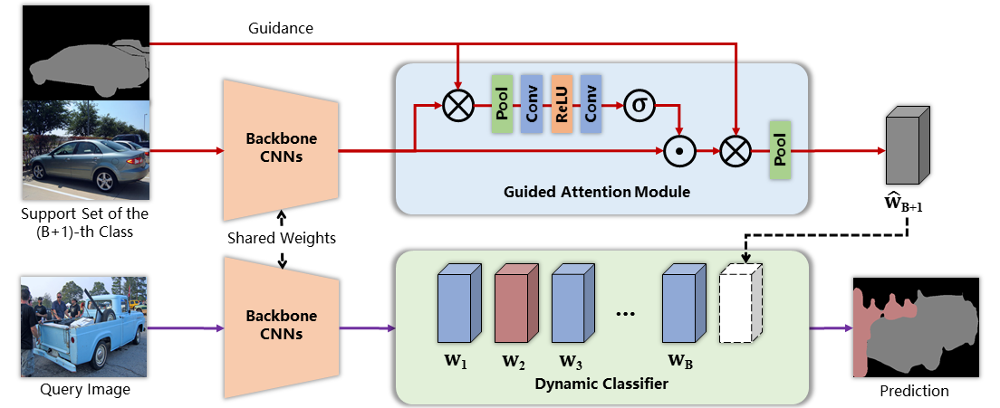
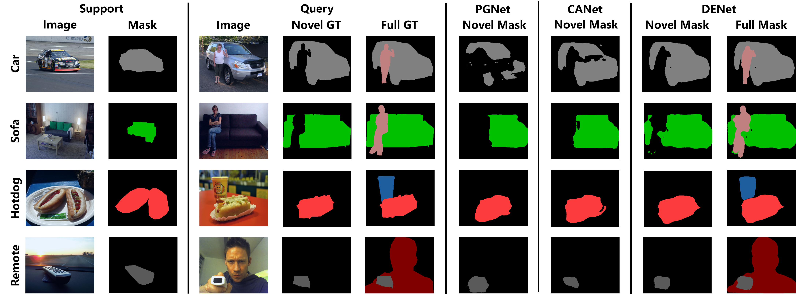
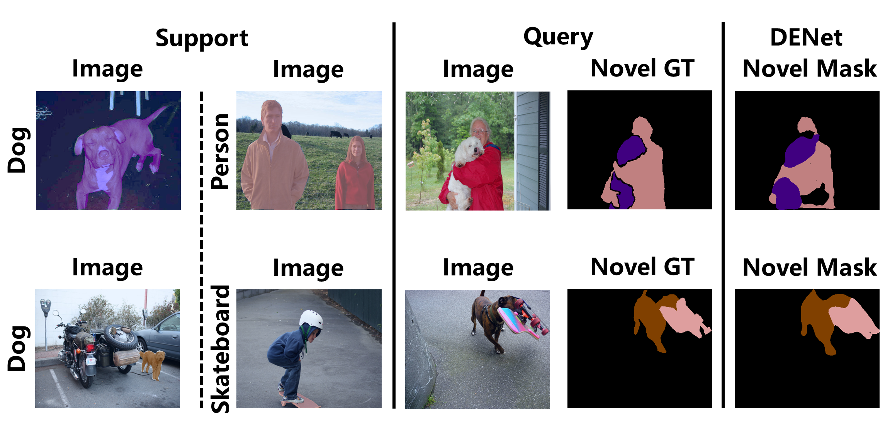
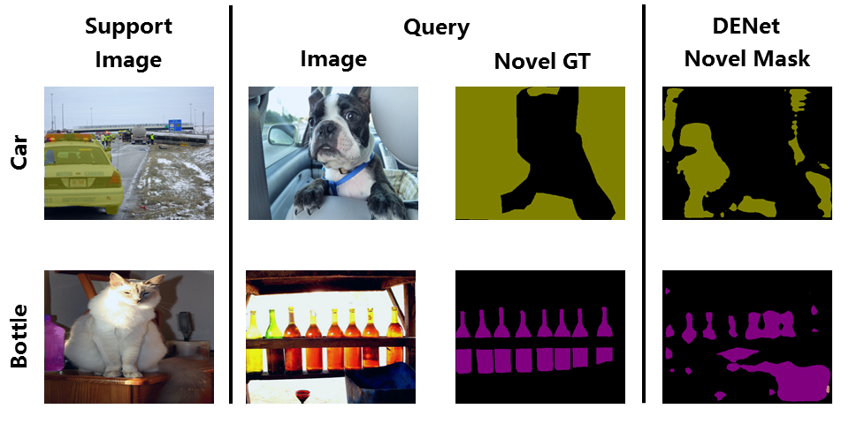

## Dynamic Extension Nets for Few-shot Semantic Segmentation
Created by Lizhao Liu, Junyi Cao and Minqian Liu from South China University of Technology.

This repository contains the official PyTorch-implementation of our [ACM MM 2020 paper *Dynamic Extension Nets for Few-shot Semantic Segmentation*](https://dl.acm.org/doi/10.1145/3394171.3413915). In particular, we release the code for training and testing the DENet and our re-implemented methods for few-shot semantic segmentation under {1, 2}-way and {1, 5}-shot settings. 

<br>



### Pretrained Models
For the convenience of relevant researchers to reproduce our results, we have release the pretrained models, tensorboard files and logs during training.
They are all uploaded to the google drive:
The config files are in [reproduce_configs](reproduce_configs).
The run script is in [run.sh](run.sh).

Note that, it may take a while to fully load the tensorboard files after running the tensorboard command.

The reproduced results are somehow better than the ones in the original paper.
<table>
<tr>
<td align='center' colspan=11><b>COCO-20<i>i</i></b></td>
</tr>
<tr>
<td align='center'></td>
<td align='center' colspan=5><b>1-way 1-shot</b></td>
<td align='center' colspan=5><b>1-way 5-shot</b></td>
</tr>
<tr>
<td align='center'></td>
<td align='center'>fold0</td>
<td align='center'>fold1</td>
<td align='center'>fold2</td>
<td align='center'>fold3</td>
<td align='center'>mean</td>
<td align='center'>fold0</td>
<td align='center'>fold1</td>
<td align='center'>fold2</td>
<td align='center'>fold3</td>
<td align='center'>mean</td>
</tr>
<tr>
<td align='center'>Paper</td>
<td align='center'>42.90</td>
<td align='center'>45.78</td>
<td align='center'>42.16</td>
<td align='center'>40.22</td>
<td align='center'>42.77</td>
<td align='center'>45.40 </td>
<td align='center'>44.86 </td>
<td align='center'>41.57 </td>
<td align='center'>40.26 </td>
<td align='center'>43.02</td>
</tr>
<tr>
<td align='center'>Reproduced</td>
<td align='center'>43.14</td>
<td align='center'>45.84</td>
<td align='center'>42.07</td>
<td align='center'>40.80</td>
<td align='center'>42.96</td>
<td align='center'>46.46</td>
<td align='center'>44.95</td>
<td align='center'>40.28</td>
<td align='center'>40.99</td>
<td align='center'>43.17</td>
</tr>
</table>

---
### Usage

#### Environment
- **PyTorch 1.3.1**
- **torchvision 0.4.2**
- **tensorboardX** for recording training information
- **tqdm** for displaying the training progress
- **pyyaml** for reading `yml` files
- A full list of dependencies are in [requirements.txt](requirements.txt), you can use
	```bash
	pip install -r requirements.txt
	```
	to download all the dependencies.

#### Dataset Preparation
1. To save your trouble, you can directly download our preprocessed datasets via google drive:
   
   * PASCAL VOC 5i (6.4GB): https://drive.google.com/uc?export=download&id=1uWNPSd_tEG5-WCRcG1sk9-5R0yI-O0XL
   * COCO 20i (23GB): The coco dataset is too large and I highly recommend you to download and preprocess it as the following instructions.
   
1. Enter the file `dataset/voc_sbd.py` and modify the `ROOT` to the path where you want to save the dataset.
	```python
	# specify root path for the data path
	ROOT = '/path/to/data'
	``` 
1. Run the function `run_VOCSBDSegmentation5i_from_scratch()` to download and process 4 subfolds of PASCAL-5*i* dataset.

1. Enter the file `dataset/coco.py` and modify the `ROOT` to the path where you want to save the dataset.
	```python
	# specify root path for the data path
	ROOT = '/path/to/data'
	``` 
1. Run the function `run_COCOStuff20i_from_scratch()` to download and process 4 subfolds of COCO-20*i* dataset.

#### Configurations
Please enter the `config` directory, we already provide you with several configuration templates for training, testing and performing inference using our DENet and some other re-implemented models. 
You **need** to create three empty files in `config` directory: `train_config.yml`, `test_config.yml` and `inference_config.yml`. Then, you can copy the content in one of the template files to fill the corresponding `yml` file. For example, you can copy the content in `train_config_denet.template` to `train_config.yml` for training with DENet. You still need to specify the path to the dataset in `yml` files.

**Note**: The provided templates use PASCAL-5*i* as the default dataset, you can change the corresponding arguments to use COCO-20*i* dataset.

#### Training
After the `train_config.yml` file is appropriately configured, training is quite simple with just one line of script:

```bash
python -u train.py
```

All the records of training information will be automatically saved to `runs/${MODEL_NAME}/${ID}`.

#### Testing
After the `test_config.yml` file is appropriately configured, you can run the following script to test the trained model:

```bash
python -u test.py
```

Likewise, all the records of testing information will be automatically saved to `runs/${MODEL_NAME}/${ID}`.

#### Inference
After the `inference_config.yml` file is appropriately configured, you can do inference with the trained model using the script:

```bash
python -u inference.py
```

The output images will be saved to `results/${MODEL_NAME}/${ID}`.

---

### Quantitive Results

- All results below are in mIoU(%)

<table>
<tr>
<td align='center' colspan=4><b>PASCAL-5<i>i</i></b></td>
</tr>
<tr>
<td align='center'>1 way 1 shot</td>
<td align='center'>1 way 5 shot</td>
<td align='center'>2 way 1 shot</td>
<td align='center'>2 way 5 shot</td>
</tr>
<tr>
<td align='center'>60.08</td>
<td align='center'>60.46</td>
<td align='center'>52.17</td>
<td align='center'>53.62</td>
</tr>
</table>

<table>
<tr>
<td align='center' colspan=4><b>COCO-20<i>i</i></b></td>
</tr>
<tr>
<td align='center'>1 way 1 shot</td>
<td align='center'>1 way 5 shot</td>
<td align='center'>2 way 1 shot</td>
<td align='center'>2 way 5 shot</td>
</tr>
<tr>
<td align='center'>42.77</td>
<td align='center'>43.02</td>
<td align='center'>38.52</td>
<td align='center'>40.87</td>
</tr>
</table>

---

### Qualitative Results

- 1 way




- 2 way



- failure cases



---

### Citation
If you find our work useful in your research, please consider citing:
		  
	@inproceedings{liu2020dynamic, 
	title={Dynamic Extension Nets for Few-shot Semantic Segmentation},
	author={Liu, Lizhao and Cao, Junyi and Liu, Minqian and Guo, Yong and Chen, Qi and Tan, Mingkui}, 
	booktitle={Proceedings of the 28th ACM International Conference on Multimedia},  
	year={2020}
	}

---

### Acknowledgments

This work was partially supported by Science and Technology Program of Guangzhou, China under Grants 202007030007, Key-Area Research and Development Program of Guangdong Province 2019B010155001, National Natural Science Foundation of China (NSFC) 61836003 (key project), Guangdong 2017ZT07X183, Fundamental Research Funds for the Central Universities D2191240.
